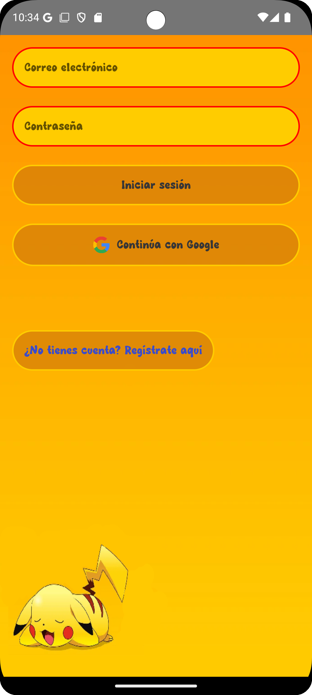
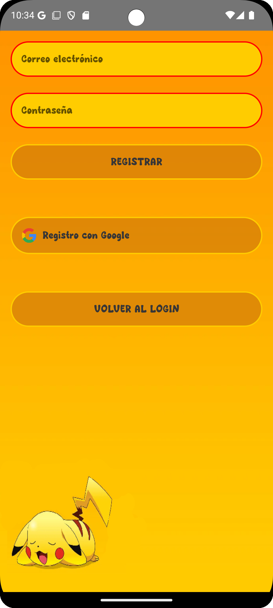
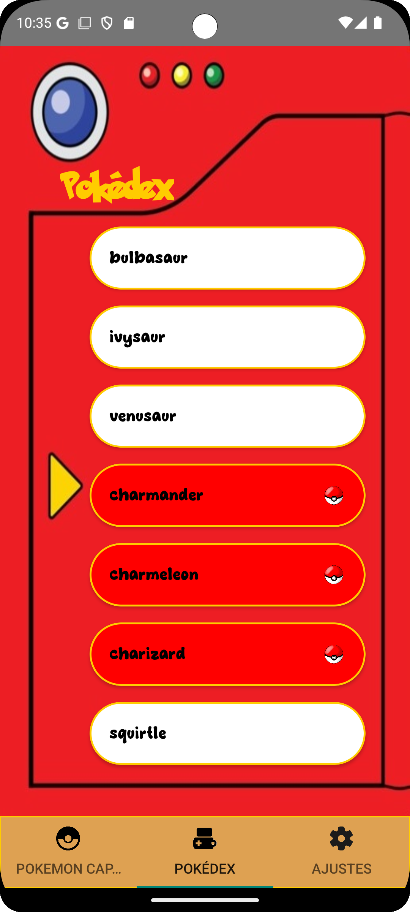
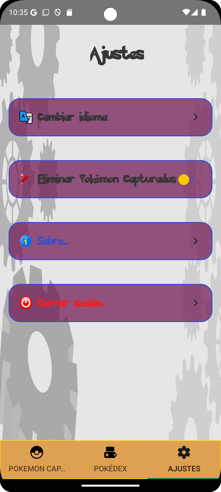

# PokemonFirebase

**PokemonFirebase** es una aplicación de Android que permite a los usuarios gestionar y explorar su propia Pokédex personal. La aplicación incluye inicio de sesión con Firebase, exploración de una Pokédex dinámica y personalización de configuraciones.

---

## 📱 Características principales

- **Inicio de sesión y registro:** Autenticación segura mediante Firebase Authentication.
- **Explora la Pokédex:** Visualiza información detallada de los Pokémon a través de una API externa.
- **Gestión de capturas:** Visualiza y administra una lista personalizada de Pokémon capturados.
- **Interfaz intuitiva:** Navegación fluida mediante `ViewPager2` y `TabLayout` con pestañas interactivas y transiciones personalizadas.

---

## 🛠️ Tecnologías utilizadas

- **Lenguaje de programación:** Java.
- **Framework:** Android SDK.
- **API de Pokémon:** Uso de Retrofit para consumir datos en tiempo real.
- **Firebase:** Usado para la autenticación y el almacenamiento de datos con Firestore.
- **Librerías:**
  - Retrofit: Para la comunicación con la API.
  - Picasso: Para la carga de imágenes.
  - Gson: Para manejar objetos JSON.
  - View Binding: Simplifica la interacción con vistas.

---

## 📂 Estructura del proyecto

### **Clases principales**

#### **Navegación y vistas**
- `MainActivity`:
  - Actúa como controlador principal de la aplicación.
  - Gestiona la navegación entre los tres fragmentos principales (`CapturedPokemonFragment`, `PokedexFragment`, `SettingsFragment`) mediante `ViewPager2`.
  - Integra transiciones personalizadas con `CustomPageTransformer`.
  - Gestiona dinámicamente los títulos e iconos del `TabLayout` mediante `TabLayoutMediator`.
  - Permite cambiar el idioma de las pestañas con el método `RefreshLanguage()`.

- `ViewPagerAdapter`: Maneja los fragmentos en el `ViewPager2`.
- `CustomPageTransformer`: Añade efectos visuales al cambiar entre páginas.

#### **Autenticación**
- `LoginActivity`: Gestiona el inicio de sesión de los usuarios.
- `RegisterActivity`: Permite crear una nueva cuenta.
- `SplashActivity`: Muestra una pantalla de carga inicial.

#### **Pokédex**
- `PokedexFragment`: Muestra una lista de todos los Pokémon disponibles.
- `PokedexAdapter`: Conecta los datos obtenidos de la API con el RecyclerView.
  - **Clase interna:** `PokemonViewHolder` maneja la vista individual de cada Pokémon.
- `PokemonDetailActivity`: Proporciona información detallada de un Pokémon seleccionado.
- `PokemonApiService`: Clase para realizar peticiones a la API.
- `PokedexResponse` y `PokemonGSON`: Clases para modelar los datos de la API.

#### **Pokémon capturados**
- `CapturedPokemonFragment`: Presenta la lista de Pokémon capturados por el usuario.
- `CapturedPokemonAdapter`: Adapta los datos de Firestore para el RecyclerView.
  - **Clase interna:** `CapturedPokemonViewHolder` maneja la vista de cada Pokémon capturado.
- `PokemonFirestone`: Modelo que mapea los datos de Firestore.

#### **Configuraciones**
- `SettingFragment`: Ofrece opciones de personalización.

---

## 🖼️ Capturas de pantalla

## 🖼️ Capturas de pantalla
{:width="400"}
{:width="400"}
{:width="400"}
{:width="400"}
{:width="400"}

---

👨‍💻 Autor
Pedro Javier Morales Leyva